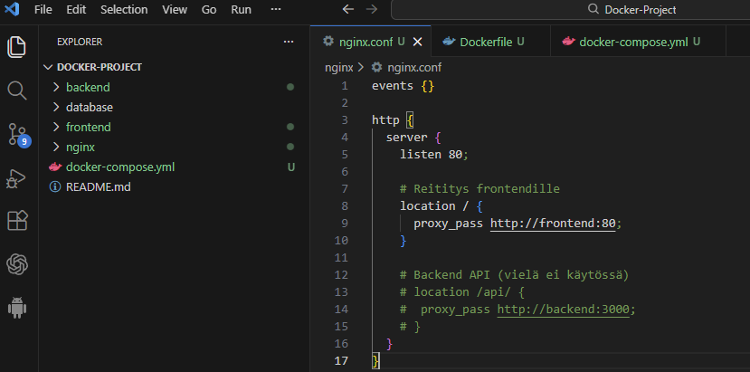
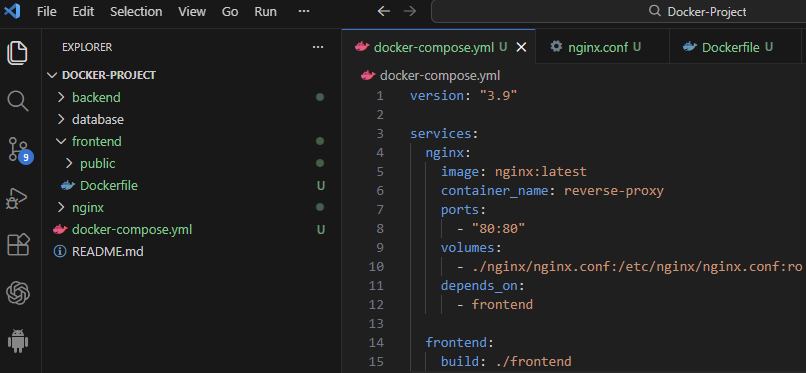
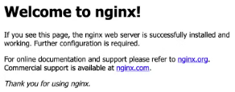
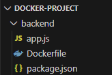
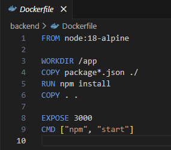

# Docker-Project

täne tulee sit jotain tavaraa loremipsun jnejne

Tässä on kuva sovelluksesta:

TÄSTÄ ALKAA DOKUMENTAATIO
Loin Dockerprojektille selkeän hakemiston: Backend, frontend, database, nginx ja lisäsin docker-compose-tiedoston.

Docker yml tiedostosta screenshot. ensimmäiset määritykset, mitä kontin ajolla ajetaan: nginx, reverse-proxy ja rakennetaan frontendiin!

nginx running ja näkyy frontendissä localhost sivulla!

Backend hakemisto

backend dockerfile

päivitin dockercompose tiedostoa. 

