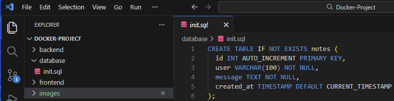
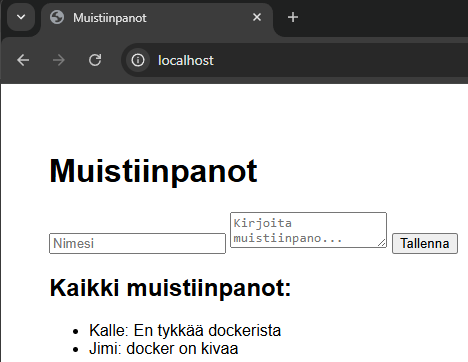
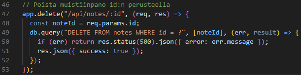
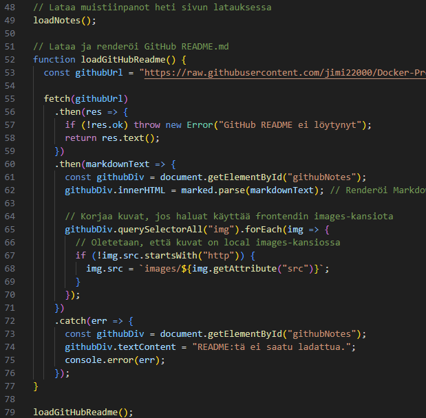
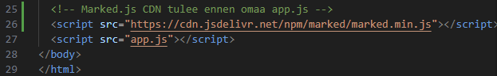
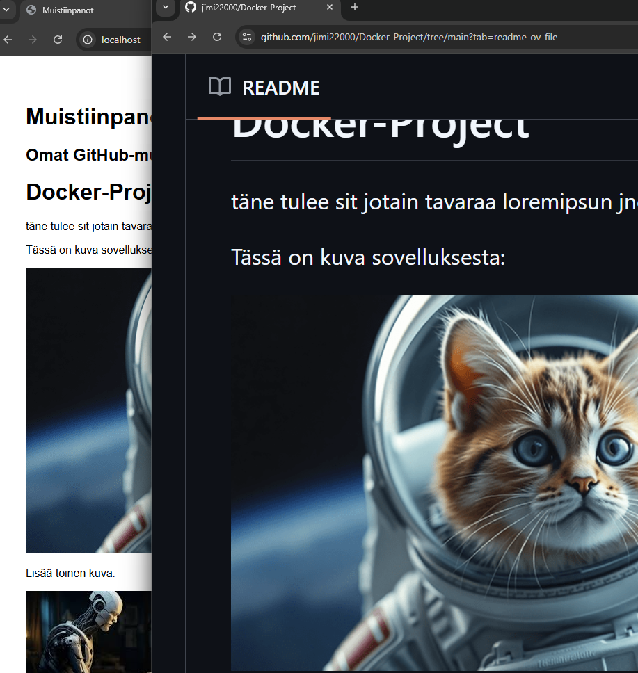
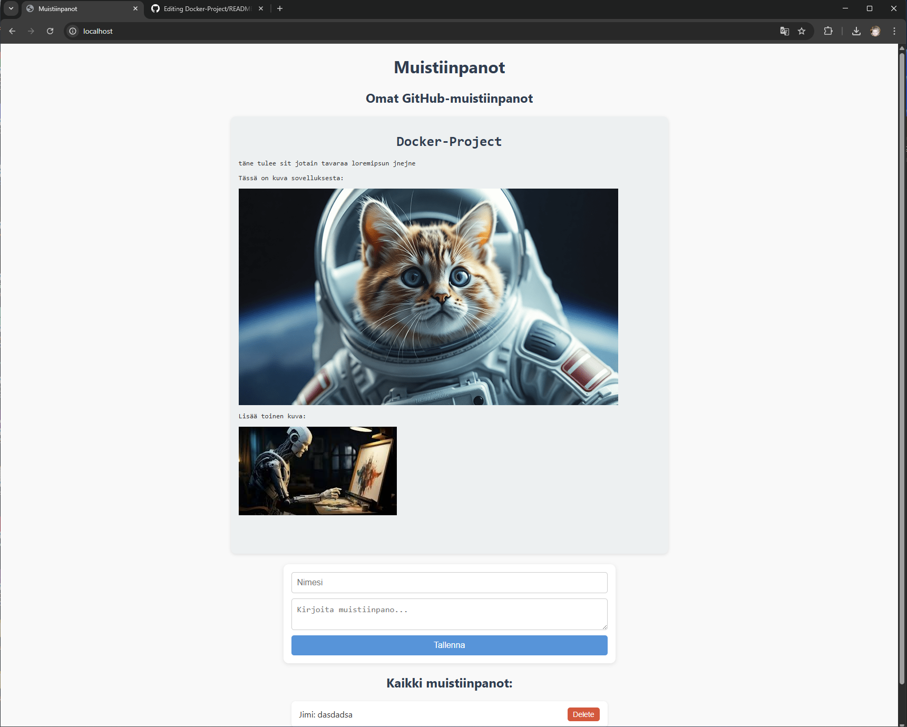

# Docker-Project

Tämä projekti esittelee yksinkertaisen Docker-pohjaisen sovelluksen, jossa on frontend, backend, tietokanta ja nginx reverse-proxy. Sovellus toimii muistiinpanojen tallennukseen ja esittelee, miten Dockerin eri kontit kommunikoivat keskenään.

---

## 1. Projektirakenne

Projekti on jaettu selkeisiin kansioihin ja tiedostoihin:

- **backend/** – Node.js backend, Express + MySQL
- **frontend/** – HTML, CSS, JS + mahdollisuus ladata GitHub README
- **database/** – MySQL init-tiedostot
- **nginx/** – nginx reverse-proxy
- **docker-compose.yml** – koko projektin orkestrointi

Tämä rakenne mahdollistaa modulaarisen kehityksen, helpottaa ylläpitoa ja tekee Dockerin käytöstä intuitiivista.

---

## 2. Sovelluksen esittely

### Sovelluskuva
  
Ensimmäinen näkymä frontendistä. Sovellus tarjoaa mahdollisuuden kirjoittaa ja tarkastella muistiinpanoja.

---

### Projektin aloitus
#### Sovelluskuva 2
  
Hakemistorakenne on selkeä ja modulaarinen. Backend, frontend ja tietokanta ovat erillisiä kontteja, mikä helpottaa skaalautuvuutta.

---

## 3. Docker-compose

docker-compose.yml määrittelee kaikki palvelut ja niiden riippuvuudet:

- **nginx** – Reitittää liikenteen frontendille ja backend API:lle
- **frontend** – HTML/CSS/JS sovellus, joka lataa muistiinpanot ja GitHub README:n
- **backend** – Node.js + MySQL, API muistiinpanojen käsittelyyn
- **database** – MySQL kontti, jossa tietokanta ja taulut luodaan init.sql-tiedostosta

### Docker-compose screenshot
  
Ensimmäiset määritykset: portit, ympäristömuuttujat, restart-säännöt ja riippuvuudet.

---

### Nginx käynnissä
  
Nginx toimii reverse-proxyna, joka yhdistää frontendin ja backendin saumattomasti.

---

## 4. Backend

Backend-hakemisto sisältää:

- **Dockerfile** – määrittää Node.js ympäristön
- **app.js** – API endpoints: muistiinpanojen luonti, haku ja poisto
- **package.json** – riippuvuudet ja skriptit

### Backend Dockerfile
  
Rakentaa Node.js kontti, asettaa portit ja ympäristömuuttujat.

---

### Päivitetty docker-compose
  
Lisätty restart-säännöt ja depends_on backendille ja database-kontille, mikä takaa järjestelmän vakaan käynnistyksen.

---

## 5. Tietokanta

### init.sql
  
database-kansiossa oleva init.sql luo taulut ja tietokannan ensimmäisen ajon yhteydessä. Tämä mahdollistaa helpon ympäristön uudelleenkäynnistyksen ilman tietojen menetyksiä.

---

## 6. Frontend ja muistiinpanot

Frontendissä on lomake omien muistiinpanojen lisäämiseen ja lista kaikista tallennetuista muistiinpanoista.

### Lisääminen ja poistaminen
  
Kokeilin toimintaa lisäämällä muistiinpanoja. Käynnistin kontit uudelleen, ja muistiinpanot säilyivät.

  
Backendin app.js tiedostoon lisätty mahdollisuus poistaa muistiinpanoja ID:n perusteella.

---

## 7. GitHub README -dokumentaation integrointi

Frontend hakee dokumentaation GitHub README:stä. Alussa suoran fetchaamisen estivät GitHubin CORS-rajoitukset, mutta raw-versio toimii ongelmitta.

  
Markdown-renderointi mahdollistaa kuvien ja tekstin esittämisen oikein frontendissä.

  
Lisätty marked.js kirjasto frontendissä Markdownin HTML-renderointiin.

  
Kokeilin sovelluksen toimintaa, ja README näkyy oikein paikallisesti ajetussa Docker-ympäristössä.

---

## 8. Tyylittely ja UX

### CSS
  
Lisätty tyylittelyä, scrollattava alue GitHub README:lle, muistiinpanojen lista ja lomake.  

### Lopputulos
  
Frontend näyttää selkeältä ja responsiiviselta. Muistiinpanot, kuvat ja dokumentaatio ovat helposti saavutettavissa.

---

## 9. Yhteenveto

Tämä projekti:

- Demonstroi Docker-konttien modulaarista käyttöä
- Näyttää miten frontend ja backend voidaan yhdistää nginx reverse-proxyn kautta
- Tarjoaa helpon tavan ladata ja renderöidä GitHub README HTML:ksi
- Mahdollistaa muistiinpanojen tallentamisen ja poistamisen MySQL-tietokannasta
- Selkeä hakemistorakenne helpottaa ylläpitoa ja jatkokehitystä
